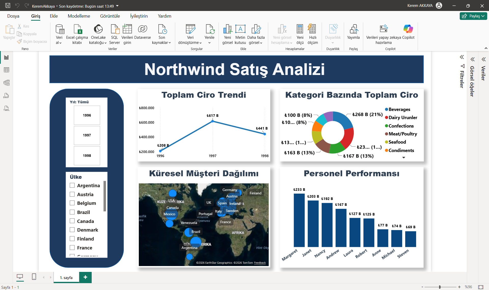

# 📊 Northwind Sales Dashboard

An interactive Power BI dashboard built using the Northwind sample database.

## 📌 Project Overview

This project analyzes sales performance and presents key business insights through interactive visualizations.

### Dashboard includes:

- 📈 Sales Trend Analysis
- 🍩 Sales Distribution by Category
- 👨‍💼 Employee Performance
- 🌍 Customer Distribution Map
- 🎛️ Interactive filters by Year and Country

---

## 🛠 Technologies Used

- Power BI
- Power Query
- DAX
- Data Modeling

---

## 📷 Dashboard Preview

---

## 📂 Repository Contents

- Northwind-Sales-Dashboard.pbix.pbix
- dashboard.png.png

---

## 👤 Author

**Kerem Akkaya**
